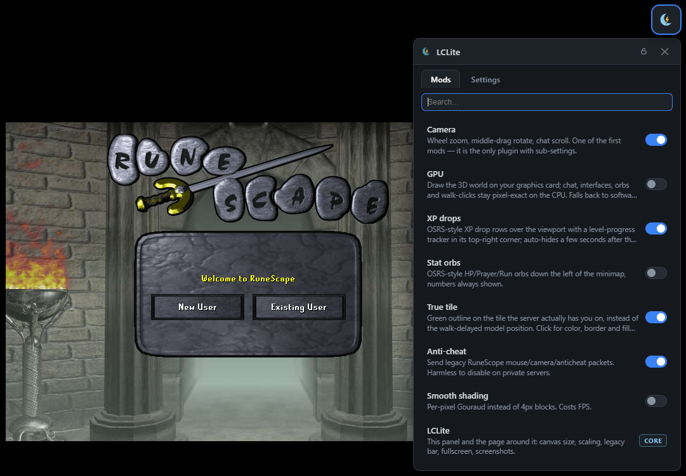

<div align="center">

# ☾ LCLite

**A RuneLite-style mod layer for the [Lost City](https://lostcity.rs) / 2004Scape webclient.**

OSRS-style camera · XP tracker · stat orbs · true tile · WebGPU renderer ·
TCG card packs — press **F1** in your game. No fork. No hand-merges.
Survives the next build.



*Node 18+ · zero dependencies · Windows double-click or any OS from the terminal*

</div>

---

## What is this?

Lost City ships a beautiful, fast-moving webclient — and every update means
re-merging your favorite tweaks into it by hand. **LCLite ends that.** You pick
your mods once; LCLite layers them onto *whatever rev you're running*, verifies
the result, and rebuilds. A Lost City update that touches a mod's code? The
installer tells you in one line exactly where the change went — you reseat it
in minutes, and every other mod applies untouched.

No game files are distributed. You bring your own Lost City installation
(and any other 2004Scape-lineage client — LCLite is host-agnostic by design,
see [custom servers](#running-a-custom-2004-server)).

## Get started (Windows)

1. Run Lost City's own `start.bat` once so the checkout has `webclient/` + `engine/`.
2. Put LCLite into that folder: `git clone https://github.com/skulltrick/lclite lclite/`
3. Double-click **`LCLite.bat`** → a checkbox list appears.

Or take the [launcher](#the-launcher-one-file-no-runtime): drop `LCLite.exe`
(8 MB, no runtime, no installer) next to `LCLite.bat` and the same double-click
opens a **setup wizard** — "which revision would you like to use?" with the branch
Lost City is developing right now already picked, then download, build and play;
the wizard hands you the launcher as soon as your world is up. From there it's a
dashboard for mods, extra revisions, running a world and joining someone else's. `LCLite.bat --cli` always gets you the plain terminal picker back.

```
 1 [X] Camera          wheel zoom, middle-drag rotate, chat scroll
 3 [X] XP drops        floating rows + level tracker
 4 [ ] Stat orbs       HP/Prayer/Energy beside the minimap
 ...
 Enter = install your selection + build
```

Done — start your server, open the webclient, **press F1**. The crescent-moon
button (top-right) does the same: every mod is a toggle, live, no reload.

<details>
<summary>Any OS / terminal</summary>

```
node lclite/tools/lclite.mjs              # same picker
node lclite/tools/lclite.mjs apply        # apply ALL mods, no build
node lclite/tools/lclite.mjs doctor       # health report of the whole overlay
node lclite/tools/lclite.mjs build        # bun bundle + deploy client.js
node lclite/tools/lclite.mjs list         # machine-readable mod state
node lclite/tools/lclite.mjs uninstall    # back toward pristine upstreams
```
</details>

## The launcher (one file, no runtime)

```
LCLite.exe        single Go binary · ~8 MB · static · Windows/Linux/macOS
```

It is a front door, not a reimplementation: every mod operation still runs
`tools/lclite.mjs`, so the overlay stays the one source of truth. What it adds is
everything the picker can't do:

- **Revision picker** — reads the Lost City branch lists live (`Client-TS`,
  `Engine-TS`, `Content`) and installs a revision as a self-contained folder:
  `webclient/` + `engine/` + `content/` at that branch, `npm install`, client
  built and deployed. Play 289's modded client and 244's vanilla one side by side.
- **Existing folder** — point it at any checkout (yours, someone else's) and drive
  mods/apply/build/play from there.
- **Mods, still convergent** — tick what you want, *Apply mods & build* passes
  `--mods a,b` through, so unticked mods are stripped. Offered on 289 only,
  because that's where the hunks are anchored.
- **Custom servers** — bridge localhost to any Lost City address, optionally
  serving **your** built client while the remote supplies the world. That's how
  your LCLite mods end up in someone else's server.

Design notes, the API, build steps and the known limits:
[`launcher/README.md`](launcher/README.md). Built it yourself:

```sh
cd launcher && go run build.go      # → dist/LCLite-<os>-<arch>
```

## The mods

| Mod | What you notice |
|---|---|
| ☾ **Camera** *(required)* | Wheel zoom (0.4–2.6×, eased), middle-drag rotate, one-shot walk pick, chatbox scroll — the OSRS feel |
| 📈 **XP drops** | Floating `+N` rows with skill icons + a tan level-progress tracker, top-right, auto-hides |
| 🔮 **Stat orbs** | HP/Prayer/Energy orbs down the minimap's lower-left, numbers always visible |
| 🟩 **True tile** | Green outline on the tile the *server* has you on — with color/border/fill controls |
| 🎨 **Smooth shading** | Per-pixel Gouraud instead of 4px blocks (when your CPU says yes) |
| 🛡 **Disable anti-cheat** | Switch ON = client stops sending the legacy mouse/camera/anticheat telemetry packets (default OFF = keeps sending). Right for a private server; leave it OFF on public worlds |
| 🚀 **GPU** (beta) | WebGPU render of the 3D world at software-exact parity; auto-falls back on any driver error, reason in the panel |
| 🃏 **TCG** (beta) | Earn credits from non-combat xp, level-ups and monster kills (combat level), open 5-card booster packs (7 rarity tiers, foils, rare apex packs), browse a 6,376-card collection album — the OSRS TCG plugin's economy, for 2004 |
| ⚙ **Control panel** *(required)* | The F1 popover itself: Mods/Settings tabs, favorite-star pinning (favorites sort to the top), per-mod gear shortcut to its settings, search, pin, fullscreen, screenshots — and the Alt+drag placement layer that lets you move the FAB, panel, XP tracker and any mod HUD to 9 snap anchors (RuneLite-style; Alt+right-click resets) |

## How it works (the honest version)

RuneLite injects plugins into a running client. A compiled, minified TypeScript
bundle can't be hot-swapped like that — so LCLite adapts the *idea* instead of
the mechanism: mods live **out-of-tree** as identity-anchored patch hunks.

```
upstream clone (pristine)  +  lclite/ overlay   →   LCLite.bat   →   your modded client
```

- **Hunks are the durable artifact.** Each mod owns a folder under `mods/`:
  minimal `{find, replace}` anchors + plain code files. On a new rev a hunk
  either applies clean or names the exact line where its anchor moved.
- **Ownership is declared, never guessed.** Every added block carries a
  `lclite:<mod>` marker; the tools route by it with 100% precision.
- **The contract is boring on purpose.** Settings are `localStorage` keys read
  at each mod's own hook; the panel discovers mods from a manifest — a new mod
  folder appears in-game with zero panel edits.
- **Mods fail alone.** One hunk that can't reseat goes quiet; the panel, the
  client, and every other mod keep working.

It is built for players and *designed* for the AI agents who help keep it
alive: every invariant is machine-checked (`tools/lclite.mjs doctor`), every rule
lives in a file a bot can read first ([`FOR_AGENTS_README.md`](FOR_AGENTS_README.md)).

## Running a custom 2004 server?

Tell LCLite what your project looks like — edit [`root.json`](root.json), the
one file that declares your repo directories and remotes. Hunks reseat against
your client's code like any Lost City rev, and your players install mods the
same double-click way. Authoring guide: [docs/MODS.md](docs/MODS.md).

## Updating when Lost City moves on

```
git -C webclient pull && git -C engine pull     # or start.bat change-version
node lclite/tools/lclite.mjs                    # picker → apply → build
```
Clean apply? Play. Failing hunks print `↳ where the anchor moved` — fix the
`find[]` in that patch JSON, rerun, and `node lclite/tools/regen.mjs` snapshots
your reseat so the overlay tracks the new rev. Full walkthrough:
[CONTRIBUTING.md](CONTRIBUTING.md).

## Layout

```
lclite/
  LCLite.bat          ← players double-click this
  tools/lclite.mjs    ← the engine behind it (apply/pick/build/doctor/new)
  tools/regen.mjs     ← snapshot your source edits into hunks
  root.json           ← host project layout (edit for custom servers)
  mods/<name>/        ← one folder per mod: patches/*.json + files/ payload
  docs/               ← MODS.md guide, HOOKS map, architecture dossier
  FOR_AGENTS_README.md ← hard rules for AI sessions (read this first)
```

## Community & status

CI runs the drift canary weekly and on every PR (pinned upstream revs +
`apply --check` + structural `doctor`), so mod-breakage is found by robots,
not by you on patch day. Issues and PRs welcome — see
[CONTRIBUTING.md](CONTRIBUTING.md).

## Disclaimer

We have not been endorsed by, authorized by, or officially communicated with
the Lost City team / 2004Scape project. "Lost City" and "2004Scape" are the
work of their contributors under their own licenses. "RuneLite" is a
trademark of the RuneLite project — the name "LCLite" and this plugin-layer
concept are homages only. No game files, assets, or cache data are
distributed with this repository; you supply your own installation.

*☾ — "lite": a crescent moon cradling a lightning bolt over your old favorite
client.*
