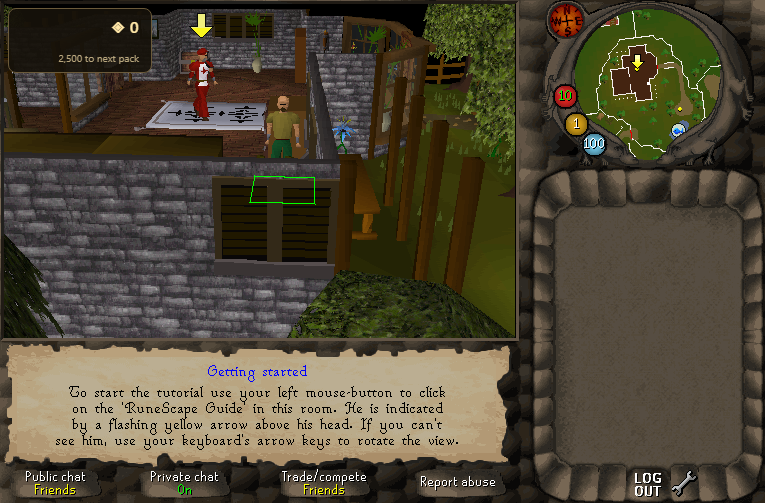
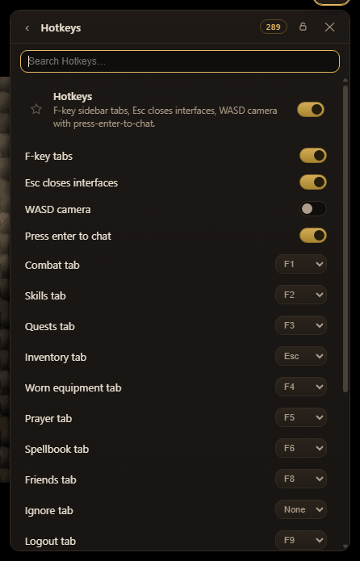

<div align="center">

# ☾ LCLite

**A RuneLite-style mod layer for the [Lost City](https://lostcity.rs) / 2004Scape webclient.**

[](https://github.com/skulltrick/lclite/actions/workflows/drift-check.yml)
[](https://github.com/skulltrick/lclite/actions/workflows/launcher-release.yml)




<sub>OSRS camera · XP tracker · stat orbs · true tile · WebGPU renderer · TCG packs — press <b>F1</b> in your game.</sub><br>
<sub>No fork. No hand-merges. Survives the next build.</sub>

</div>

---

## Why

Lost City's webclient moves fast, and every update turns your hand-picked tweaks
into a merge conflict. **LCLite ends that.** Mods live *out-of-tree* as
identity-anchored patch hunks; you pick them once and LCLite layers them onto
whatever revision you're running, verifies the result, and rebuilds. When Lost
City lands code under a mod's anchor, the installer says exactly where it moved
— you reseat it in minutes and every other mod applies untouched.

> No game files are distributed. You bring your own Lost City installation — or
> any 2004Scape-lineage client ([LCLite is host-agnostic](#custom-2004-server)).

## Quick start

1. **Get the launcher** — one line: `cd launcher && go run build.go`, or grab the
   portable zip from [Releases](https://github.com/skulltrick/lclite/releases) when
   one is published. It's a single ~8 MB static binary with no runtime.
2. **Double-click `LCLite.bat`** — the wizard asks which revision you want (the
   branch Lost City is developing right now is pre-picked), then clones, builds
   and starts it for you. A first boot repacks the cache, so give it a minute.
3. **Press F1 in-game** — every mod is a toggle, live, no reload.

After that the launcher is your dashboard: mods, extra revisions side by side,
running a world, joining someone else's.

<details>
<summary><b>Any OS / terminal — the Node CLI</b></summary>

The overlay is plain scripts and runs anywhere. Nothing is cloned into this
repo: the launcher installs each revision into its own data folder
(`%LOCALAPPDATA%\LCLite\installs\<rev>\{webclient,engine,content,lclite}`, or
`~/.local/share/lclite` elsewhere) and drives *this* overlay against it.

```
node tools/lclite.mjs list                                    # machine-readable mod state
LCLITE_ROOT=/path/to/install node tools/lclite.mjs apply      # apply every mod
LCLITE_ROOT=/path/to/install node tools/lclite.mjs apply --check
LCLITE_ROOT=/path/to/install node tools/lclite.mjs build      # bundle + deploy client.js
LCLITE_ROOT=/path/to/install node tools/lclite.mjs doctor     # health report
```

An "install" is any folder holding `webclient/` + `engine/`. Copy this repo
inside one as `lclite/` and the tools find it without `LCLITE_ROOT`.
</details>

## The mods

Twelve mods, one folder each. Names are the ones you'll read in the panel.

| | Mod | What you notice |
|---|---|---|
| ☾ | **Camera** | Wheel zoom (0.4–2.6×, eased), middle-drag rotate, one-shot walk pick, chatbox scroll — the OSRS feel |
| 🟩 | **True tile** | Outline on the tile the *server* has you on, with color/border/fill controls |
| 🔮 | **Stat orbs** | HP / Prayer / Energy orbs down the minimap's lower-left, numbers always visible |
| 📈 | **XP drops** | Floating `+N` rows with skill icons plus a tan level-progress tracker, auto-hiding |
| 🏠 | **Hide roofs** | Roofs everywhere, not only while you stand under them |
| 🧱 | **Low detail** | RuneLite's Low Detail switch: untextured ground, no decorations, half-size textures |
| ⇧ | **Shift-click drop** | Hold Shift and left-click an item to drop it, skipping the menu |
| ⌨ | **Hotkeys** | F-key sidebar tabs, Esc closes interfaces, WASD camera with press-enter-to-chat |
| 🛡 | **Disable anti-cheat** | ON = the client stops sending legacy mouse/camera/anticheat telemetry (default OFF — leave it OFF on public worlds) |
| 🚀 | **GPU** *(beta)* | WebGPU render of the 3D world at software-exact parity; falls back on any driver error, reason shown in the panel |
| 🃏 | **TCG** *(beta)* | Credits from xp, level-ups and kills → 5-card packs (7 tiers, foils, rare apex packs) → a 6,376-card album |
| ⚙ | **LCLite** | The panel itself: search, favorites, per-mod settings, Alt+drag placement, fullscreen, screenshots |



<sub>The panel in game: one mod's settings at a time, favorites on top, every row a live switch.</sub>

## How it works

RuneLite injects plugins into a running client. A compiled, minified TypeScript
bundle can't be hot-swapped like that — so LCLite adapts the *idea* instead of
the mechanism.

```
pristine upstream clone  +  this overlay  →  apply  →  bun build  →  your client
```

- **Hunks are the durable artifact.** A mod is a folder: minimal `{find, replace}`
  anchors plus plain code files. On a new rev a hunk either applies clean or names
  the line its anchor moved to.
- **Ownership is declared, never guessed.** Every added block carries a
  `lclite:<mod>` marker, so the tools route by identity with 100% precision.
- **The contract is boring on purpose.** Settings are `localStorage` keys read at
  each mod's own hook; the panel discovers mods from a manifest, so a new mod
  folder appears in-game with zero panel edits.
- **Mods fail alone.** A hunk that can't reseat goes quiet; the client and every
  other mod keep working.

## When Lost City moves on

In the launcher: select the install → **Update from GitHub** (fast-forwards
client, engine and content, re-applies mods, rebuilds). By hand:

```
git -C <install>/webclient pull && git -C <install>/engine pull
LCLITE_ROOT=<install> node tools/lclite.mjs apply --check   # ✗0 on every mod
LCLITE_ROOT=<install> node tools/lclite.mjs                 # picker → apply → build
```

A failing hunk prints `↳ where the anchor moved`; fix that `find[]`, rerun, then
`node tools/regen.mjs` snapshots the reseat so the overlay tracks the new rev.
Full walkthrough: [CONTRIBUTING.md](CONTRIBUTING.md).

## Custom 2004 server

Tell LCLite what your project looks like by editing [`root.json`](root.json) —
the one file that declares your repo directories and remotes. Hunks reseat
against your client's code like any Lost City rev, and your players install mods
the same double-click way.

## The launcher

```
LCLite.exe     single Go binary · ~8 MB · static · Windows / Linux / macOS
```

A front door, not a reimplementation: every mod operation still runs
`tools/lclite.mjs`, so the overlay stays the single source of truth. It adds the
revision picker (installs a branch as a self-contained folder, `npm install`
included), "use an existing folder", the convergent mod list, local-world
running, and a localhost bridge for joining a Lost City server with **your**
client.

```sh
cd launcher && go run build.go     # → dist/LCLite-<os>-<arch>
```

Design notes, the HTTP API and the known limits: [`launcher/README.md`](launcher/README.md).

## For mod authors & AI agents

- [`docs/MODS.md`](docs/MODS.md) — how to author a mod (TYPE A UI / TYPE B engine
  / TYPE C entities), the panel↔engine contract, the ideas register.
- [`FOR_AGENTS_README.md`](FOR_AGENTS_README.md) — the hard rules, and the loop to
  follow when you're an AI session working on this repo.
- `node tools/doctor.mjs` — one command that machine-checks the whole overlay
  (hunk coverage, markers, rev pins, wording drift).
- `bash tools/acceptance.sh` — the strong gate: pristine clones at the pinned
  revs + apply must reproduce a live install byte-for-byte, then a
  strip/re-apply converge round-trip must land on the same bytes.

## Layout

```
LCLite.bat / LCLite.exe   ← what players double-click
launcher/                 ← its Go source (stdlib only)
tools/                    ← lclite.mjs (apply/build/doctor) · regen.mjs (hunks) · acceptance.sh
mods/<name>/              ← patches/*.json + files/ payload + README.md
docs/                     ← MODS.md guide, HOOKS map, architecture dossier, archive/
root.json                 ← host project layout (edit for custom servers)
FOR_AGENTS_README.md      ← read this first if you're an agent
```

Revisions live outside git, in the launcher's data folder
(`installs/<rev>/{webclient,engine,content}`). `tree = f(upstream@rev, overlay)`
still holds — the overlay just no longer has to live *inside* the tree it patches.

## Status

CI runs two canaries weekly and on every PR — pinned revs + `apply --check` +
structural `doctor` — and the launcher is built and smoke-tested on every release
tag. Issues and PRs welcome: [CONTRIBUTING.md](CONTRIBUTING.md) ·
[RELEASING.md](RELEASING.md).

## Disclaimer

Not endorsed by, authorized by, or affiliated with the Lost City / 2004Scape
project. "Lost City" and "2004Scape" are the work of their contributors under
their own licenses; "RuneLite" is a trademark of the RuneLite project — the name
"LCLite" and this mod-overlay concept are homages only. No game files, assets or
cache data are distributed with this repository; you supply your own installation.

<div align="center"><sub>☾ — “lite”: a crescent moon cradling a lightning bolt over your old favorite client.</sub></div>
